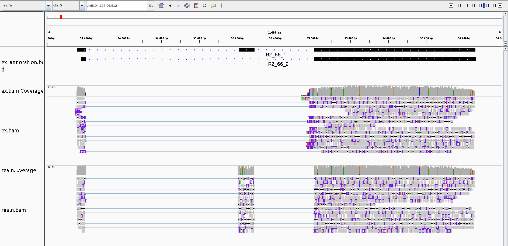
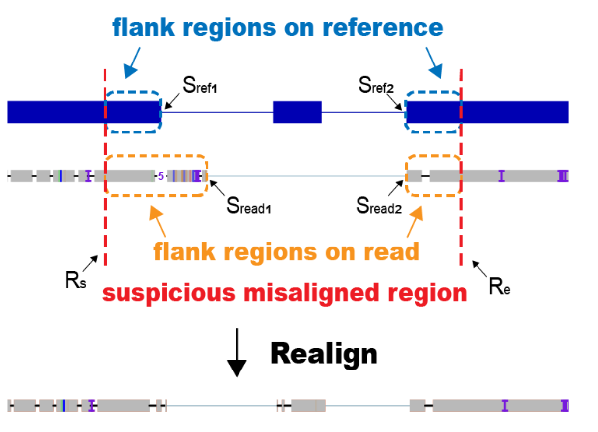

# MisER-project
An annotation based method to find and fix small exons missed alignment defects in Nanopore long reads.


The example plot above show the misaligned exon in the middle is find by compaired the reference annotation BED and realigned to the correct position. When we use [minimap2](https://github.com/lh3/minimap2) to align ONT cDNA reads, it is easy to miss the exon with small size, because of the difficulty to find an exact match anchor in these region.

### INSTALLATION

`pip install MisER`

Upgrade to a newer version using:
`pip install MisER --upgrade`

The package is written for python3

### INPUT

MisER requires four essential arguments.
- BAM file
- genome reference fasta (with index fai in the same directory)
- transcript annotation in BED12 format
- the target file for the output exon-missed regions information 

### OUTPUT
- regions which have missed small exons
- realigned BAM file which are fixed 

### USAGE
```
MisER [-h] [-v] [-c N] [-s N] [-d float] [-f N] [--strandSpecific]
              [--allTranscripts] [--fixFlankLen] [--debugMode] [--setTag]
              [-o file | --onlyRegion]
              inBam genomeFasta annotBed outRegion

positional arguments:
  inBam                 Input original bam file.
  genomeFasta           Reference genome FASTA file, with fai index under the same directory.
  annotBed              Annotated transcripts file in BED12 format.
  outRegion             Output Region file, regions contain missed small exons.

optional arguments:
  -h, --help            show this help message and exit
  -v, --version         Print version and exit.
  -c, --coreNum N       The number of cpu cores we used. (default: 1)
  -s, --exonSizeThd N   The threshold of exons size, ignore exons with size > exonSizeThd. (default: 80)
  -d, --deltaRatioThd float
                        The threshold of absolute delta ratio, ignore abs(delta ratio) > deltaRatioThd.
                        (default: 0.5)
  -f, --flankLen N      The extended length on the both sides of realign region. (default: 20)
  --strandSpecific      Only compare reads consistent with annotated strand. (default: False)
  --allTranscripts      Return all possible missed exons among overlapping transcripts. (default: False)
  --fixFlankLen         Flank length will not extend to cover the adjacent indels. (default: False)
  --debugMode           Won't stop when meet an error in one read. (default: False)
  --setTag              Set fr tags on the realigned reads (default: False)
  -o, --outBam file     Output realigned bam file. (default: None)
  --onlyRegion          Only return the Region file without realign process. (default: False)

```

### NOTES

Misaligned exons are absent from annotated position and connected to the neighbour exon as extra protruding parts with high error rate. MisER will first select all introns on reads which overlap with annotated exons and set borders on the suspected misaligned regions. Then MisER tries to realign the read sequence in region and compare the alignment score before and after realignment. If alignment score improves, the region will be assigned as misaligned region.

- **Delta length** As the picture show above, *Delta length* is defined as the extra bases between reads flank exons and reference flank exons. Intuitively, it is the bases count in the extra protruding parts. We find the reads introns if the intron overlaps with the annotated exon, and then check whether the *Delta length* close to the *exon length*. It is easy to think that *Delta length* should be close to the *Exon length* if they come from the annotated exon.
- **Flank length** In order to define the range of the realign region. we set the region start = min(annoted splice site, read splice site) - *Flank length* and the region end = max(annoted splice site, read splice site) + *Flank length*
- **Delta ratio** *Delta ratio* = (*Delta length* - *Exon length*) / *Exon length*. We choose *Exon length* <= `--exonSizeThd` and *Delta ratio* <= `--deltaRatioThd` to filter out the false positives and record the regions as suspected exon-missed region. The regions information is output in `outRegion`.
- `--allTranscripts` One Read intron may be overlapped with exons on multiple transcripts. As default, we only return the annotated transcript with minimum *Delta raio* as the correct reference. You can set `--allTranscripts` to keep all possible transcripts reference. In the realign process, we only keep one realign result among different transcript, the one with highest realignment score will be kept.

We use [parasail](https://github.com/jeffdaily/parasail-python) to do the global pairwise alignment between read sequence and annotated exon sequence in the realign region. We only keep the realign result if realigned score > original score. 
ATTENTION: the original score does not refer to the AS field in BAM if provided. We calculate the realigned score and origial score based on the realignment and original alignment in the realign region, and the score is equal to the matched bases count - edit distance. As different alignment tools may have different score system, we do not change the AS of NM field in BAM if provided.
- `--onlyRegion` Although we default to return the realigned result in `-o, --outBam file`, you can set the `--onlyRegion` to skip the realign process (although the realign process is not the bottleneck at present).
- `--strandSpecific` This argument is used if the original reads is stranded RNA-seq. We will only try the strand of mapping read to find the overlapped exons.

### EXAMPLE USAGE
```bash
git clone https://github.com/zhenLiuXplr/MisER-project
cd examples
MisER ex.bam ex.fa ex_annotation.bed ex_realign_region -o realn.bam
```
Be careful that chromosome in annotBed, genomeFasta and inBam should have same naming style (All in UCSC style like "chr1" or in Ensembl style like "1"). Inconsistent naming style will lead to failed judgement.

### Using Short-read data for novel microexon detection
To detect novel microexons in long-read sequencing data of not-well-annotated genomes, high-accuracy short-read RNA-seq can serve as a viable approach to acquire transcript annotations, using genome mapping at first and then transcript assembly, such as `STAR` (for genome mapping) and `Cufflinks` (for transcript assembly). These assembled transcripts can be utilized as annotations for MisER and correcting the misaligned small exons in long-read sequencing data.

To install STAR and Cufflinks, user can use conda package management system:
```
conda create -n env_name -c bioconda star cufflinks
source activate env_name
```
For short-read genome mapping (STAR):
```
# Build reference genome index
STAR --runMode genomeGenerate --runThreadN <number of threads> --genomeDir <genome index output directory> --genomeFastaFiles <reference genome FASTA file> --sjdbGTFfile <annotated transcripts GTF files, optional>
# Mapping reads to genome
STAR --genomeDir <genome index directory> --readFilesIn <short-read FASTQ files, for single-end: reads.fq; for paired-end: reads1.fq reads2.fq> --outSAMtype BAM SortedByCoordinate --outFileNamePrefix <output files prefix>
```
STAR will generate a BAM file `prefixAligned.sortedByCoord.out.bam` which can be used in transcript assembly (Cufflinks):
```
Cufflinks -o <output directory> -p <number of thread> prefixAligned.sortedByCoord.out.bam
```
Cufflinks will generate a transcript annotation `transcripts.gtf` in GTF format.

For converting GTF format into BED12 format, which is required for MisER `annotBed`, you can use the R package `rtracklayer`:
```
# Install r-base and rtracklayer
conda install -c bioconda bioconductor-rtracklayer
# Enter the R console
R
# In R console
library("rtracklayer")
gtf = import("transcripts.gtf")
exon = subset(gtf, type == "exon")
tx = asBED(split(exon, exon$transcript_id))
export(tx, "transcripts.bed", format="bed")
```
The generated `transcripts.bed` file (BED12 format) can be used as `annotBed` in MisER.

### ACKNOWLEDGMENTS/CONTRIBUTORS
- Zhen Liu for building and maintance
- Wu Wei and Chenchen Zhu for advising

### CONTRIBUTING
Welcome for all suggestions, bug reports, feature request and contributions. You can leave an [issue](https://github.com/zhenLiuXplr/MisER-project/issues) or open a pull request.

### CITATION
If you use this tool, please consider citing our [publication]()
